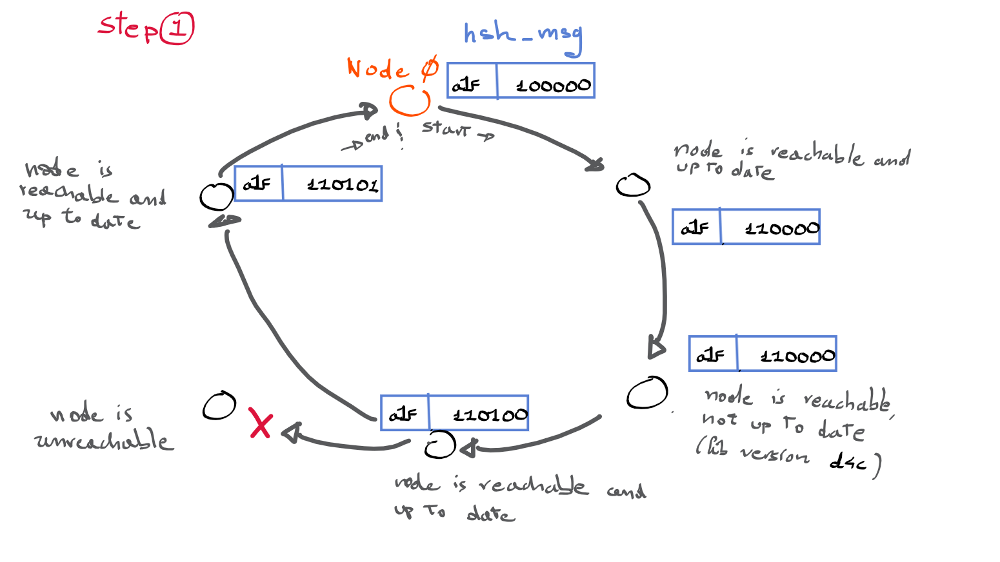
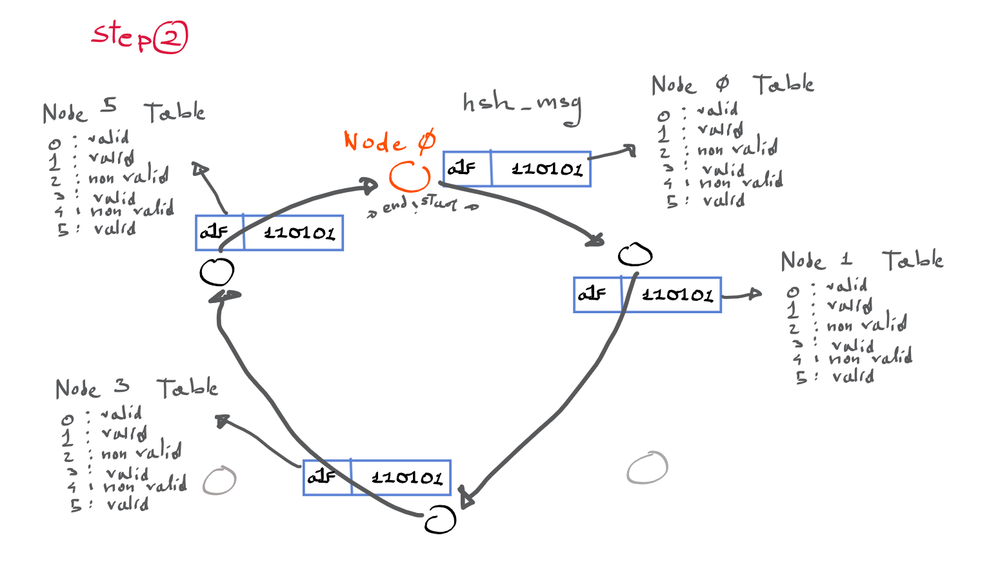
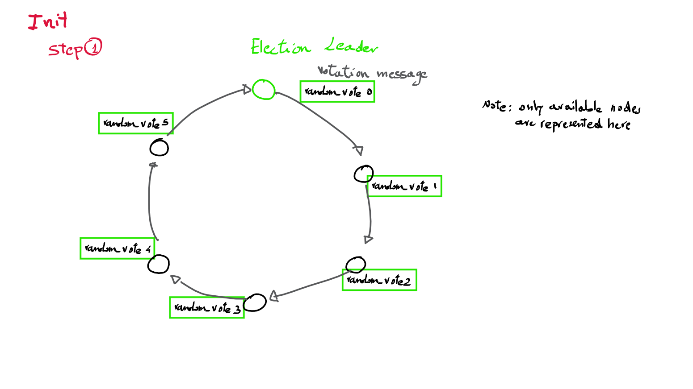
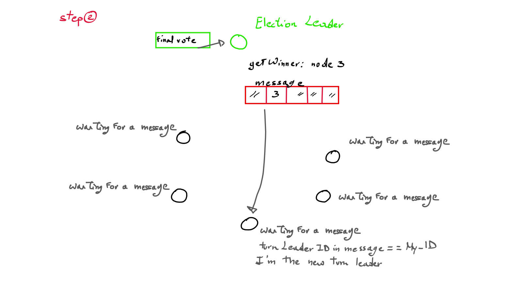
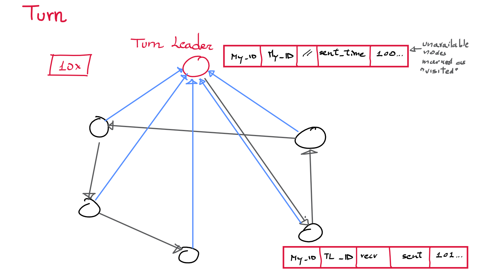
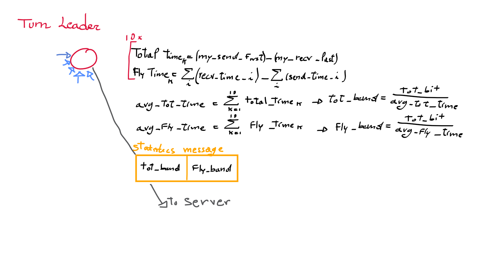

# ARP#3 – Common Protocol

To aid us all in overcoming the plausible difficulties in understanding the code in the common library, 
this file contains a detailed description of the protocols to be used for the ARP Third Assignment. 
I hope this can be helpful for our work!

## Namespaces

As you have probably noticed, there is a prefix for each of the library modules; this was intended to ease in
finding functions and understanding their uses. Here are all the main namespaces:

-	**iptab_** prefix for the address table (where we can find all the addresses of the nodes in the network)
-	**hsh_** prefix for the functions within the handshake module
-	**vote_** prefix dedicated to the functions for the votation step
-	**message_** prefix for the methods we have to use for the common message 
-	**net_** prefix for the functions that handle sockets

Some other important remarks:

-	most of the times, we don’t need to interact directly with the custom types of the library; 
	it's sufficient to use the functions for processing those types.
-	There are modules, such as bitvector, that aren’t useful for us; we can take a look to these pieces of codes 
	of course, but it's strongly suggested to not use them directly unless we’re very very VERY sure about what we’re doing.
	They are here since they are indirectly used by other, higher level, functions, that "mask" their inner workings for our purposes.
-	There are fields whose name starts with the double underscore;
	these are meant to be private, so using those variables/functions/macros in the code is not encouraged, unless… 
	the same stuff we discussed previously.
	
Some names of important data structure which we have to instantiate in our code:

-	**handshake_t** the type of message used to perform the handshake step (the first thing to do at the start of the algorithm!)
-	**votation_t** to be used during votation step (first part of each turn), where a new Turn Leader
-	**message_t** is the standard message exchanged during the turn
-	**stat_t** is the message used for sending the statistics to RURZ's server

---

## Handshake Step

This step is needed for inspecting how many nodes are available in the net before starting the experiment.
A node is considered available if it meets these conditions:
-	It’s using the most recent release of the common header (please, don’t alter the file */handshake/version.h*, 
	it is not needed in your work).
-	It is reachable via a TCP socket.

The node with ID zero is considered as the starting point of the handshake.
Only the nodes of the coordinators can be elegible as 'zero' nodes, simply to aid in the maintenance of the network.
While in the final, "global" test, only one zero node will be present, each of the coordinators nodes can become 
"local" zero nodes when performing tests restricted to their group.

Please keep into account that we do not know a priori what ID will be assigned to our node, 
because the final table will be generated only few days before the experiment.; that's why we have in any case to check 
what is our ID immediately at the node start.

#### General Idea

We want to check which nodes are available at the time the node "ZER0" is booted (which should hence be the last to go online)
in order to avoid getting blocked after having tried with no luck to reach a node which appears in our IP_table but which, for
some reason, is not online at the moment! Plus, since all nodes in the net rely on the same headers, we should be sure that all
are actually using the same version, or we could be trying to read messages that changed format or other similar issues.
We have thus to exclude from the global table of existing nodes those which are not reachable or outdated: to do so a message is
sent from the "ZER0" node (the first in the table, a little asymmetry needed) and passed *twice* along the "ring" of nodes in order 
(following the IDs associated to all IP addresses in the table from 0 to the last one).
This message simply contains a list of flags, one for each node in the table, indicating whether that node is *available* or not, 
as well as a string identifying the library version of the zero node (considered to always be up to date). Initially all flags
are set to "not available".
The first time a node receives this message it should check if its library version coincides with the one indicated in the message,
and if that's the case it should set its flag in the message as "available", then it will have to pass this to the next reachable
node in the net (the first node with larger ID than this one we can establish a connection with).
Once this message returns to the ZER0 node (after necessarily passing through all the reachable nodes) its "available" field will 
contain information on the availability of all nodes in the net. The message is thus sent once again along the ring: each time a node
receives it the only thing it has to do is updating its local IP_table, so that it will have a record of only the nodes partaking in 
the communication.

#### The algorithm

Steps for node ZER0:
1.	After checking that we are the node zero (*hsh_imfirst(MY_IP_STR)*)…
2.	Prepare the message for the handshake (*hsh_init(&hshmsg)*)
3.	We should not forget to mark ourselves as available! (*hsh_check_availability(…)*)
4.	Try and find the next available node (see *connection.h* header); we have to use sockets for checking if one of the 
	nodes next to us is available (see addresstable.h, in particular the method *iptab_get_next()*, paying attention to 
	the fact that the field *"my"* shouldn’t necessarily be our node ID*); we should avoid directly using the flag “available” of 
	the message in this step! All the functions are already provided to us for updating our (local) address table.
5.	When we find the next available node, we have to pass the message to it
6.	We should wait for the message to come back here after going all along the "ring" of nodes
7.	When this message is returned to us, we have to update our address table (see *hsh_update_iptab(…)*)
8.	Then the message should once again be sent to the next *available* node, so that all other nodes can update their tables as well.
9.	The second time the message comes back we can kick on the next phase, the first *turn*.
>> 	(*) eg. check your next node, if the connection works keep going on, else try with the following node, calling 
	iptab_get_next(my_ID+1, msg) and so on

Steps for nonzero node:
1.	First of all, check if we are or not the first node: trivial, but don’t forget it (I'm looking at you all coordinators!)
2.	Wait for an handshake_t message (see the utilities in connection.h, nothing different from receiving any message)
3.	After receiving the message, we should check our availability using the function *hsh_check_availability(…)*
4.	Independently from what value the function returned to the program, we must send the message to our next node; 
	see step 4 for zero node, the procedure to be implemented is almost the same. 
5.	If the function returned 0, we must close our program because there’s something wrong with our version of the header. 
	We can close at this point, because the above-mentioned function checked us as unavailable, so we are "no longer in the net", 
	we will thus receive no messages from other nodes.
6.	Otherwise, we should hold on for the returning of the handshake message (we already know it should pass twice along the ring).
7.	Once we receive the updated handshake message we can finally update our address table (see *hsh_update_iptab(…)*)
8.	Then, as before, we have to send the handshake message to the next *reachable* node in the table (see *iptab_get_next()*)

At the end of this procedure, all the nodes are ready for the first turn.

 

---

## Turn

Each turn is divided in two parts: 
1.	Election of a turn leader: init step
2.	"(broken) telephone": message are passed between nodes in random order

10x init step
{
> 10x "(broken) telephone"  

}

Here as well, the library facilitates the work, handling the stressful parts while leaving us with placing the “logical blocks”;
we simply have to call the methods in the right order and following the common protocols. All the available nodes are cycles 
that execute these steps in sequence.

### Init step

#### General Idea

Aka “votation” (this word doesn’t exist in English … my bad. Which node is the master during the election?
-	Immediately after the handshake, the election master is the ZER0 node
-	Otherwise, it is the turn leader of the previous turn

All the functions we need for handling the votation_t message type are provided by the library.
In this phase we have to elect a new Turn Leader, and we do so by - once again - passing a message along the entire *reachable*
net in a ordered way, following once more the nodes ID in the IP_table. The first time such message is received the node
should express its *random* preference, then pass the message to the next node. Once the message reaches the current "votation" Leader
that nodes retrieves the winning node from the global votation and generates a "normal" message, only containing that winner ID, 
sending this directly to the winner node.
Every node should thus wait for the receival of the first message, checking the "turnLeader" field in it: if that value corresponds
to the current node ID this has been elected as the new Turn Leader and should thus behave accordingly, else this has to be considered
simply as the first message out of a series of 10.

#### Algorithm for the “votation” master:

1.	Initialization of the votation_t message
2.	Express our vote (see *vote_do_votation(…)*)
3.	Send the message to the next available node in the table (see *iptab_get_next(YOUR_NET_ID)*)
4.	When the message comes back to us, we have to call *vote_getWinner()* on it to get the winner of the election
5.	If we are the winner, we can skip the next two steps and simply behave as the next TurnLeader; otherwise, keep reading this.
6.	Instantiate a common message_t and use on it the function msg_set_ids() putting into the field turn_leader the ID of the winner
7.	Then, send to the winner the message with its ID in the field *turnLeader*.

#### Algorithm for the voter:

1.	We are not the previous Turn Leader…
2.	Wait for a votation_t message
3.	When the message is received, we perform our votation (with great effort of imagination, *vote_do_votation()*)
4.	Then deliver the message to the next node; if the next node is the election master, we are the last voter, 
	hence the election is concluded (not a problem we have to take care of)
5.	In every case, we have to wait for the first common message of the turn and read the field "turnLeader": if its value coincides
	with our node ID we've just become the next Turn Leader, hurray!
	This phase is mixed with the execution of the turn, just a little (absolutely illusory) complication for us;
	it is sufficient to start the turn algorithm and verify the turn leader ID for the first message, breaking the cycle and going
	into the Turn Leader "approach" if we happen to be it. Or, probably easier, considering the first message separately from the
	following nine ones, entering either the "normal" or "turn leader" cycles accordingly.

 

### "(broken) telephone"

#### General Idea

The turn leader was elected; it’s time to start the game!
Each "player" (non-TurnLeader) node has to read an incoming message, registering the instant it arrived, set itself as visited and
then sending its message to both a further, randomly selected and non-visited, node **and the current Turn Leader**
(adding to the message the timestamp of the instant preceeding this write); note that if no node remains to be visited only the 
second instance of the message should be sent.
We consider two different measures for the time to which to compute the bandwidth upon:
- the total time (recv time of the last message from the Turn Leader - sent time of the first message sent from the Turn Leader)
- the time that each message used to travel in the network (thus excluding the computational
time inside each node). This is why the Turn Leader receives a copy of all messages, so that it can know precisely the "fly time" of
each message.  

*Total_Bandwidth*: 10x(dimension_of_each_message)/total_time  
*Fly_Bandwidth*: 10x(dimension_of_each_message)/fly_time
>> 	NOTE: we cannot be sure to receive *ordered* messages, since we have multiple sender... however, this is actually not as issue,
	since we can simply sum all "sent" times (including the time at which the Turn Leader sent the first message) and subtract all the
	"recv" times (including the instant at which the Turn Leader received the message from the last unvisited node in the chain).

#### Algorithm for a player node:

1.	Procedure for the first message (very very very important), as already mentioned in the end of the **init** phase:
a.	wait for the first message
b.	read the field “turnMaster” (it is the only case in which we’re authorized to directly access to a field of a standard 
	data structure; we should not alter it, otherwise the whole experiment would break down)
c.	if the ID of the turn master is equal to our ID, we have to break this algorithm and go to the Turn Leader protocol
d.	otherwise, go on
2.	Immediately after receiving the message, we must reset its receiving time field (*msg_set_recv(...)*)
3.	Mark our node as visited (*msg_mark(...)*)
4.	If all the nodes are now visited (*msg_all_visited(...)*), the next node we should send the message to is the Turn Leader;
	else…
5.	… we we have to select the next node which we'll send the message to, using the methods in message.h.
	The unavailable nodes were already marked when we received the message;
	this operation was done by the Turn Leader before starting the turn. By using the functions provided to in the library,
	we'll not have troubles with this as everything is handles transparently by those functions! We **MUST** use the function 
	*msg_rand(...)* in order to obtain the next available node ID; the function checks automatically for availability of the ID 
	it may return; in case of error, or if we are the last node (*in which case we shouldn't already be trying to get a "next 
	available node"*), the function returns -1. 
6.	Set the IDs (*msg_set_ids(...)*): the turn leader is the same we received, and the ID is our ID
7.	Now it is possible to fill in the sending time (*msg_set_sent(...)*)
8.	And deliver the message to the next node, whatever it will be.
9.	**only if you're not the last node**, send a copy of the same message to the turn leader. It's important to take into account 
	this:*don't send twice this message to the turn leader*. So, if the node is not the last one of the turn, it have to execute this 
	step; otherwise, go on. 
10.	We have then to be ready for the next message: the votation_t or another message_t, depending on how many times we passed into
	this loop
11.	If we already performed 10 turns for all 10 different Turn Leaders, exit.

#### Algorithm for the turn leader:

1.	If we’re the new turn leader…
2.	We have to create a new message_t, and initialize it
3.	Set our ID in the fields ID and TurnLeader
4.	Mark as visited all the unavailable nodes (a simple loop, see addresstable.h for retrieving the ‘available’ flag) and ourselves. *also*
	*mark yourself as visited*; in this way, it's sufficient for the player to call *msg_all_visisted()* for understanding if it is teh last
	node or not.
5.	Randomly select the node to which to send the message to (*msg_rand(...)*)
6.	Now we are ready to start the turn. we first fill the sending time, then read the generated value directly from the data 
	structure, and save it; it will be useful to you for computing the bandwidth, since it's the time in which the first 
	message was sent.
7.	Finally, we send the message
8.	As mentioned, we need to receive a copy of each message, so we should have a loop with an accept() and some code, as in the
	example "server2" seen during the course (however, without the need for a fork, since it's enough here to simply save the
	recv and sent times in the messages read and then close() that socket). Since we assume that all nodes in the net will be 
	reachable (so no one will disconnect after the initial handshake phase, a simplifying assumption) the loop can simply be a for()
	with as many iterations as there are reachable nodes (-1 for the Turn Leader itslef of course!). The node will wait for *as many *
	*messages as the available nodes, minus 1*. For instance, assume we have 10 nodes in the net, but only 5 among those are available; so, the 
	turn leader has to wait for only 4 messages; remember that the last message is sent once.
9.	We then compute the bandwidth on both the total time and the total fly time (see formulas on the sketch), and save those values. 
10.	Be ready for another turn if we're not in the last turn (GOTO 1), or...
11. 	If we performed all 10 turns we have to aggregate data and send them: we compute the average of all 10 total bitrates
	and of all 10 fly bitrates, insert those values in a stat_t message 
	(*stat_message_init()*, *stat_message_set_totBitrate(...)*, *stat_message_set_flyBitrate(...)*)
	and send to RURZ server (whose IP and port number can be obtained with *stat_get_serverInfo(...)*)
12. 	Then perform a new election, unless we already performed 10 of them (GOTO "votation" phase), else...
13. 	Exit

 
